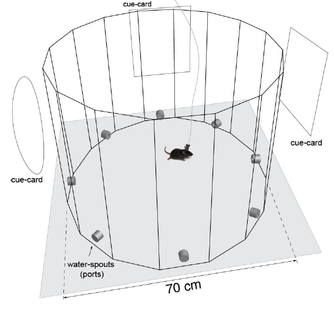
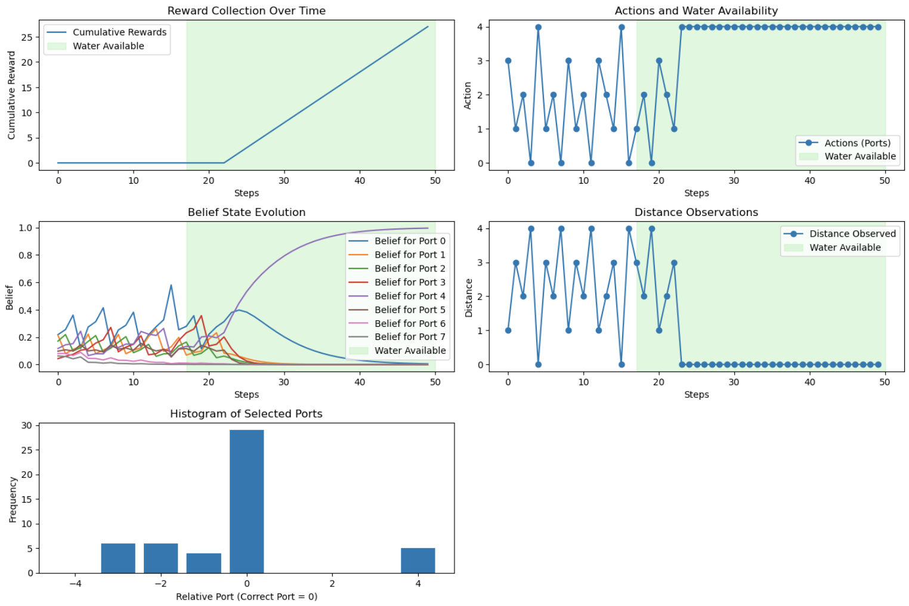
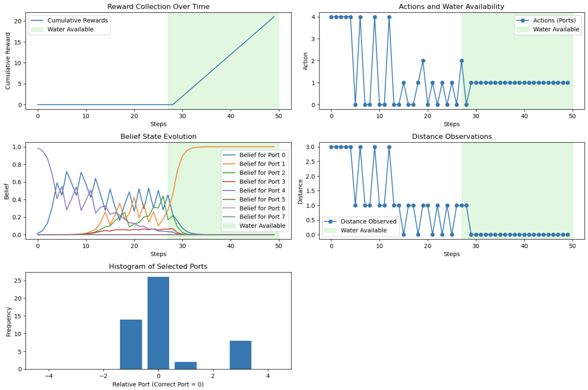
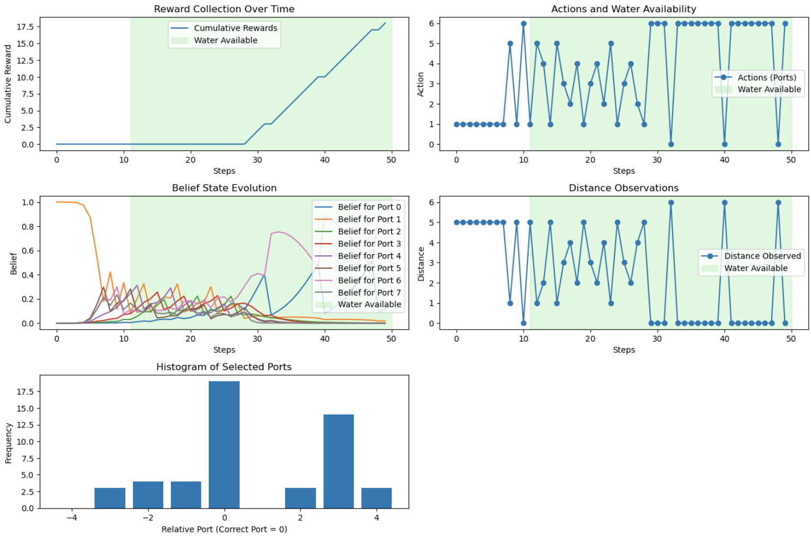
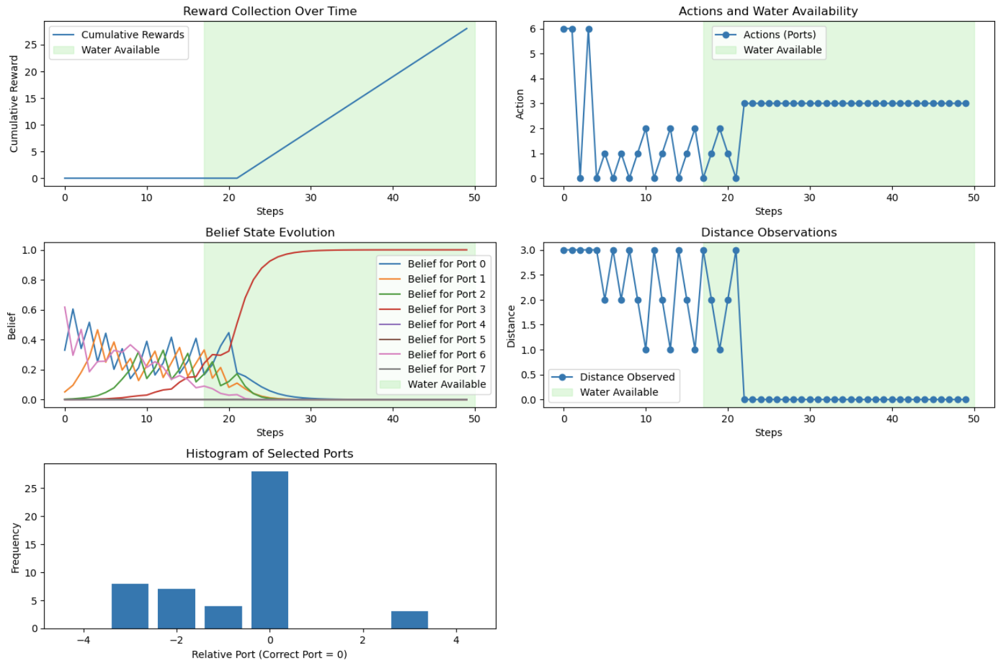
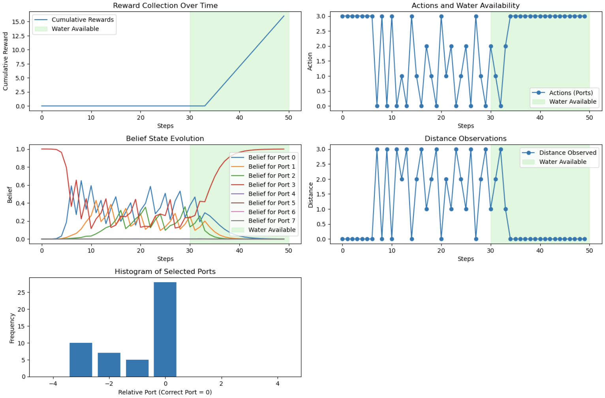

# MemoryRL


A Python implementation of a Partially Observable Markov Decision Process (POMDP) to simulate mouse behavior in a multi-port experiment. The goal is to mimic how a mouse learns to find the correct port where water becomes available after a delay, while also displaying exploratory behavior.

## Features
- Simulates a mouse's decision-making process to find water in one of several ports.
- Implements Bayesian belief updates and Q-value-based action selection.
- Includes plotting functions to visualize:
  - Cumulative rewards.
  - Actions taken by the mouse.
  - Belief state evolution.
  - Observations and distance to the target port.


## Theoretical Background

### Partially Observable Markov Decision Process (POMDP)

  A POMDP is a framework used for decision-making when the agent has limited observability of the environment. It consists of:

  - States (S): The true underlying condition of the environment (in this case, which port is correct).

  - Actions (A): The choices available to the agent (which port to poke).

  - Observations (O): Noisy, indirect information about the state (distance to the correct port, availability of water).

  - Transition Model (T): The probability of moving from one state to another.

  - Observation Model (O): The probability of receiving a particular observation given a state and action.

  - Reward Function (R): The numerical feedback given for different actions.


### 8-Port Maze Task

This model is designed to replicate the 8-Port Maze Task, a standard experimental setup in behavioral neuroscience used to study spatial learning and decision-making in rodents. 



The key elements of this task include:

  - A circular arena with 8 equally spaced ports.
    
  - Each day is split into two phases: training and recall.

      - Training phase: The mouse learns the correct port by interacting with the environment.
      
      - Recall phase: The mouse attempts to remember the correct port based on prior experience.
  
  - The mouse starts from a central location and can poke different ports.
  
  - Only one port provides water, and it becomes available when the animal come into the trigger zone.
  
  - Rodents exhibit exploratory behavior, often poking nearby ports before consistently selecting the correct one.
  
  - Learning is assessed by tracking how quickly the subject shifts from exploration to consistent selection of the correct port.

This model aims to capture these dynamics by using a POMDP framework, where the agent must infer the correct port over time based on noisy observations and rewards.

### Behavioral Modeling

  In neuroscience and psychology, reinforcement learning (RL) is used to model how animals learn from rewards and adapt their behavior. This model follows trial-and-error learning, where the mouse gradually increases its preference for the correct port while still exhibiting exploration.

## Model Implementation

### States

  The agent (mouse) is in one of 8 ports.

### Actions

  The mouse can poke any of the 8 ports in an attempt to find the correct one.

### Observations

  - Noisy Distance: The mouse receives an estimate of how far the selected port is from the correct one.

  - Reward Availability: The agent only gets a 1 (water available) when poking the correct port after a random delay.

### Rewards

  - 1.0 for choosing the correct port after water is available.

  - 0.3 for poking an adjacent port.
  
  - 0.1 for poking a port two steps away.
  
  - 0.0 for poking farther ports.

### Exploration vs. Exploitation

  The model encourages exploratory behavior by allowing the agent to receive small rewards for nearby ports.
  
  As the agent updates its belief state, it starts focusing more on the correct port but continues to explore.


## Results and Visualizations

### Day 1

Correct Port: 4



### Day 2

Correct Port: 1



### Day 3

Correct Port: 6



### Day 4

Correct Port: 3



### Day 5

Correct Port: 3



## How to Use the Model

1. Clone the Repository

   ```bash
   git clone https://<GITHUB TOKEN>:x-oauth-basic@github.com/Jercog-team/MemoryRL
   cd MouseBehaviorPOMDP

2. Install Dependencies

    Ensure you have Python installed along with the required libraries:

    ```bash
    pip install numpy matplotlib

3. Run the Simulation
   
   ```bash
    python main.py

This will execute the simulation and generate the visualizations.

